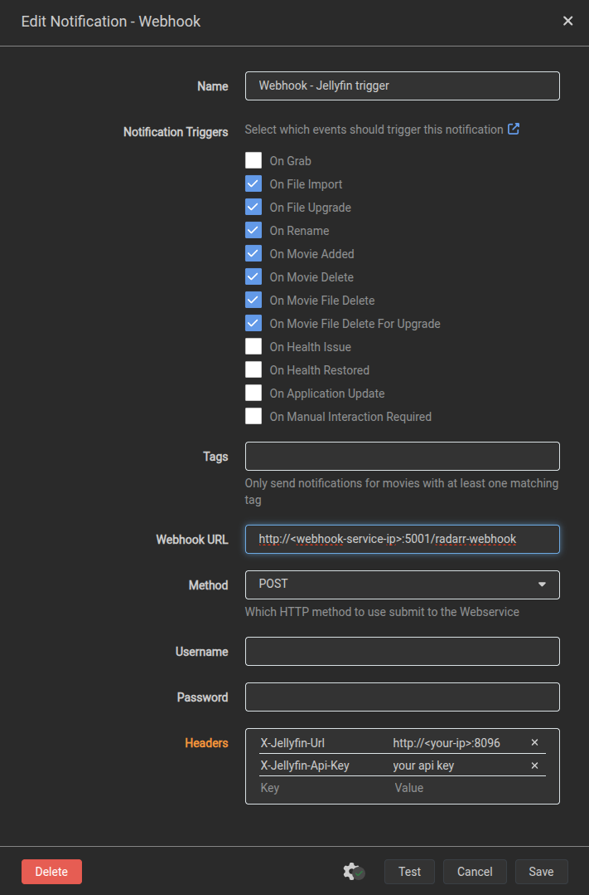

# Radarr Jellyfin Notifier

This is a simple Flask application that listens for webhook events from Radarr and triggers a library refresh on Jellyfin.

## How it works

- The app exposes an endpoint `/radarr-webhook` to receive POST requests from Radarr.
- Radarr should send custom headers: `X-Jellyfin-Url` (your Jellyfin server URL) and `X-Jellyfin-Api-Key` (your Jellyfin API key).
- Upon receiving a Radarr event, the app triggers a refresh on the Jellyfin library by calling the Jellyfin API.

## Flask Application

The app runs a Flask server on port `5001` and listens for Radarr webhook events.

## Running with Docker

### Dockerfile

The Dockerfile uses Python 3.12 slim image, installs dependencies via `uv` package manager, and runs the app with:

```dockerfile
FROM python:3.12-slim

WORKDIR /app

COPY uv.lock .

RUN pip install --no-cache-dir uv && uv install

COPY . .

EXPOSE 5001

CMD ["uv", "run", "main.py"]
```

### docker-compose.yml

The docker-compose file builds the Docker image named `radarr-jellyfin-notifier`, maps port 5001, and mounts the local directory for easy development:

```yaml
version: '3.9'

services:
  radarr-jellyfin-notifier:
    build:
      context: .
      dockerfile: Dockerfile
    image: radarr-jellyfin-notifier
    ports:
      - "5001:5001"
    # volumes:
    #   - .:/app
    command: uv run main.py
```

## Using Radarr Webhook

- In Radarr, go to **Settings > Connect**.
- Add a new **Webhook**.
- Set the URL to `http://<your-server-ip>:5001/radarr-webhook`.
- Add the following custom headers:
  - `X-Jellyfin-Url`: Your Jellyfin server URL (e.g. `http://jellyfin.local:8096`)
  - `X-Jellyfin-Api-Key`: Your Jellyfin API key
- Save and test the webhook.



## Running Locally (without Docker)

Make sure you have `uv` installed and your dependencies in `uv.lock`.

Run:

```bash
uv run main.py
```

The app will listen on port 5001.

## License

MIT License
